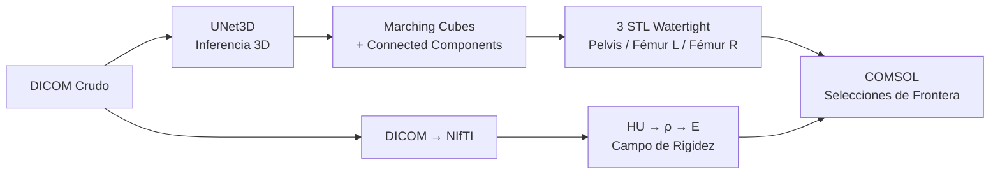

# Pipeline Biomecánico: DICOM a Elementos Finitos (FEM) con IA

Este repositorio contiene la arquitectura de software desarrollada para automatizar la reconstrucción tridimensional y el análisis biomecánico de estructuras óseas (pelvis y fémur). Mediante Inteligencia Artificial (Redes Neuronales Convolucionales 3D), se extrae la topología ósea de tomografías computarizadas (CT/DICOM) y se exporta como mallas listas para simulaciones de Elementos Finitos en COMSOL Multiphysics.

> [!NOTE]
> Para una explicación exhaustiva sobre la matemática, las Ecuaciones en Derivadas Parciales de Navier-Cauchy y el modelo de convergencia de la Inteligencia Artificial, por favor lee el documento científico [informe_avance.md](./informe_avance.md).

---

## 🗂️ Estructura del Proyecto

El código está modularizado separando estrictamente la preparación de datos, la Inteligencia Artificial y la física del continuo.

```text
Automatizacion FEM/
├── data/                       # ⚠️ IGNORADA EN GITHUB (Ver nota abajo)
│   ├── 01_raw/                 # Tomografías DICOM originales (Pacientes + Fantomas)
│   ├── 02_processed/           # Mallas STL, NIfTI y mapas de materiales generados
│   ├── 03_models/              # Pesos pre-entrenados de la red (.pth por época)
│   └── 04_training_patches/    # Tensores 3D extraídos y filtrados (Negative Sampling)
├── src/                        # Código fuente modular
│   ├── neural_manifold/        # Módulo IA: UNet3D, Inferencia, Dataset, Loss y Segmentación
│   │   ├── unet_topology.py    #   Arquitectura de la Red Neuronal Convolucional 3D
│   │   ├── inference.py         #   Reconstrucción volumétrica por Sliding Window
│   │   ├── segment_pde.py       #   Separación de componentes conexos y sellado Watertight
│   │   ├── train_unet.py        #   Orquestador del entrenamiento con checkpointing
│   │   └── dataset_pde.py       #   Dataset y DiceLoss diferenciable
│   └── tensor_pde/             # Módulo Física: Mapeo de materiales, Meshing y COMSOL
│       ├── comsol_mapper.py     #   Exportación de campos E(HU) y selecciones de frontera
│       ├── material_mapping.py  #   Biyección HU → ρ → E (Módulo de Young)
│       ├── mesh_repair.py       #   Cierre topológico (Watertight) para FEM
│       └── io_module.py         #   Ensamblado de tensores DICOM y matrices afines
├── logs/                       # Registros (Logs) de salida del clúster HPC
├── main.py                     # Orquestador principal del pipeline completo (Fase 1→3)
├── comparar_epocas.py          # Visualización evolutiva del aprendizaje (Mapas de Calor)
├── prepare_dataset.py          # Script de limpieza y generación de parches
├── requirements_cluster.txt    # Dependencias exactas para HPC (Python 3.6+)
├── run_cluster.slurm           # Orquestador de trabajos para SLURM
├── informe_avance.md           # Informe científico con justificación matemática
└── README.md                   # Esta guía
```

---

## 💾 Nota sobre los Datos (Por qué no está la carpeta `data/`)

Si descargas o clonas este repositorio, notarás que la carpeta `data/` y todos los archivos de extensión `.npy`, `.dcm` o `.pth` no están presentes. 

Esto es **intencional**. El set de datos tomográficos original y los parches extraídos tras el proceso de *Negative Sampling* superan los **30 GB** (llegando a 180 GB en su estado crudo), lo cual excede por mucho los límites arquitectónicos de GitHub. 

**Para reproducir el entrenamiento:**
1. Deberás colocar tus propios archivos médicos en `data/01_raw/` (un subdirectorio por paciente).
2. Ejecutar localmente el script `python prepare_dataset.py`.
3. Esto destilará el conocimiento mediante *TotalSegmentator*, aislará las regiones de interés y generará automáticamente la estructura pesada de carpetas que la IA necesita.

---

## 🏗️ Pipeline Completo (Fases 1 a 3)

El archivo `main.py` orquesta las tres fases del pipeline de forma secuencial:



1. **Fase 1 (IA):** La UNet3D segmenta el volumen óseo completo mediante ventana deslizante.
2. **Fase 2 (Geometría):** La máscara binaria se convierte en mallas 3D separadas por hueso usando Teoría de Grafos (Componentes Conexos), y se sellan topológicamente para garantizar compatibilidad FEM.
3. **Fase 3 (Física):** Se exporta el volumen HU como NIfTI, se mapean las propiedades biomecánicas (Módulo de Young heterogéneo) y se generan las selecciones de frontera (Neumann/Dirichlet) para COMSOL.

```bash
python main.py
```

---

## 🚀 Instalación y Despliegue en Clúster HPC

Este pipeline está fuertemente optimizado para ser ejecutado en nodos de supercómputo que utilizan gestores de colas **SLURM**, permitiendo entrenamiento distribuido en CPU utilizando OpenMP.

1. **Clonar el repositorio:**
   ```bash
   git clone https://github.com/AgustinG178/CNN_FEM.git
   cd CNN_FEM
   ```

2. **Instalar Dependencias:**
   Asegúrate de utilizar las versiones exactas provistas para garantizar la compatibilidad de PyTorch y Torchio con intérpretes Python legados en servidores.
   ```bash
   python3 -m pip install --user -r requirements_cluster.txt
   ```

3. **Lanzar el entrenamiento:**
   ```bash
   sbatch run_cluster.slurm
   ```
   Puedes monitorear el progreso y la caída de la función de pérdida matemática (*Dice Loss*) utilizando:
   ```bash
   tail -f logs/entrenamiento_[#Reemplazar el '#' y los corchetes [] con el id asignado por SLURM en la salida del comando anterior, e.g., 92456, esto puede visualizarse usando el comando "squeue" para ver la lista completa o "squeue -u $USER" para rastear el usuario concreto que se busca, en este caso el nuestro, e.g. "tail -f logs/entrenamiento_92456.log"].log
   ```
