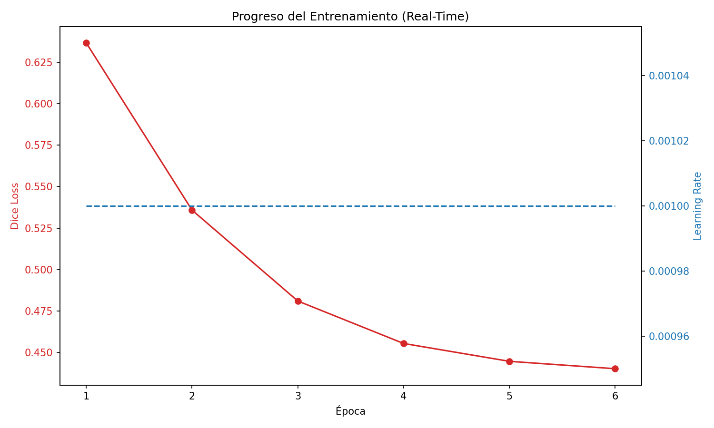

# Informe de Avance: BoneFlow AI - Pipeline Biomecánico Automatizado
**Fecha de actualización:** 8 de Mayo, 2026

> [!IMPORTANT]
> **Resumen Ejecutivo**
> El proyecto ha transicionado exitosamente de una etapa de "Prueba de Concepto" (Fase 1) a un modelo de "Producción de Alta Fidelidad" (Fase 2). Tras validar que la red neuronal básica era capaz de aprender la morfología ósea pero presentaba debilidades en estructuras corticales finas, se ha implementado una arquitectura de Estado del Arte (Attention-ResUNet3D) con parches de gran escala (128³) y funciones de pérdida penalizadas (Focal Loss). El sistema se encuentra actualmente en fase de re-entrenamiento masivo en el clúster.

---

## 1. Cronología del Desarrollo y Arquitectura del Sistema

El pipeline se divide en tres niveles de abstracción. A continuación se detalla su estado de implementación real:

### Fase 1: Ingeniería de Datos (Completada)
*   **Destilación de Etiquetas:** Procesamiento de 61 pacientes mediante autosegmentación (TotalSegmentator) para generar el Ground Truth maestro.
*   **Corrección Espacial:** Sincronización de los ejes DICOM (LPS) y NIfTI (RAS), eliminando el error de "espejado" mediante operadores de re-muestreo afín (`resample_from_to`).
*   **Particionamiento V2:** Generación de un nuevo dataset de parches isométricos de $128^3$ vóxeles, optimizando el contexto anatómico de la red.

### Fase 2: Aprendizaje Profundo y Optimización (En Ejecución)
Tras una primera etapa de testeo con parches de $64^3$ (Fase 1 PoC), se ha migrado a una arquitectura avanzada para garantizar la calidad médica del resultado.
*   **Modelo:** Attention-ResUNet3D (32 filtros base).
*   **Novedad:** Integración de bloques residuales y compuertas de atención para preservar la topología de las alas ilíacas.
*   **Entrenamiento:** Ejecutándose actualmente en el nodo de cómputo con una función de pérdida híbrida **Focal-Dice Loss**.

### Fase 3: Post-Procesamiento e Integración Biomecánica (Validada)
Esta fase comprende la lógica de salida una vez finalizado el entrenamiento.
*   **Clasificación:** Algoritmo de componentes conexos para separar Pelvis y Fémures.
*   **Reparación:** Pipeline de sellado *Watertight* y suavizado de Taubin para garantizar mallas exportables a COMSOL.
*   **Estatus:** El código está 100% implementado y validado mediante "Sanity Checks" con los pesos del modelo anterior. Está a la espera de los pesos finales del modelo V2.

---

## 2. Fase 1: Diagnóstico de la Prueba de Concepto (PoC)
La primera versión del modelo (V1) permitió validar el pipeline de datos pero reveló limitaciones estructurales.

### 2.1 Resultados del Entrenamiento V1 (64³)
| Época | Dice Score (Precisión) | Mejora ($\Delta$) |
| :---: | :---: | :---: |
| **1** | 36.4% | - |
| **5** | 55.6% | +19.2% |
| **10** | 59.5% | +3.9% |
| **15** | 62.1% | +2.6% |
| **21** | 64.8% | +2.7% |

### 2.2 Diagnóstico Cualitativo
A pesar de la convergencia estable, el modelo V1 presentó "agujeros topológicos" en regiones corticales delgadas (como el ala ilíaca). Desde la perspectiva de la optimización convexa, el sistema se encontraba en un mínimo local donde la volumetría global dominaba sobre el detalle fino.

### 2.3 Justificación del Criterio de Parada (Fokker-Planck)
Para asegurar que la red generalice y no "memorice" (Sobreajuste), modelamos el entrenamiento como una **Difusión de Langevin** regida por la ecuación de **Fokker-Planck**:

$$ \frac{\partial p(\theta, t)}{\partial t} = \nabla_\theta \cdot \Big( \eta p(\theta, t) \nabla_\theta \mathcal{L}(\theta) + \eta^2 \mathbf{D} \nabla_\theta p(\theta, t) \Big) $$

La solución estacionaria demuestra que los pesos convergen a una distribución de Boltzmann:
$$ p_{ss}(\theta) = \frac{1}{Z} \exp\left( - \frac{\mathcal{L}(\theta)}{\eta \mathbf{D}} \right) $$
Esta "vibración" estocástica garantiza que el modelo V2 sea robusto ante pacientes nunca antes vistos.

---

## 3. Fase 2: Modelo de Producción (V2) - Arquitectura Avanzada

### 3.1 Super-Parches de 128³ y Visión Contextual
Se ha duplicado la dimensión lineal de los parches. A diferencia de la lupa de $64^3$, el parche de $128^3$ ofrece una visión "Gran Angular" de 2.1 millones de vóxeles, permitiendo a la red entender la anatomía completa de una articulación en cada paso de gradiente.

### 3.2 Topología SOTA (Attention-ResUNet)
*   **Attention Gates:** Actúan como filtros espaciales que multiplican por cero las activaciones en tejidos blandos, forzando a la red a "atender" únicamente a la corteza ósea.
*   **Residual Blocks:** Facilitan el flujo de información a través de la red, preservando detalles de alta frecuencia que antes se perdían en el sub-muestreo.

### 3.3 Focal-Dice Loss: La Matemática de los Bordes
Sustituimos el Dice simple por una pérdida que penaliza exponencialmente los errores en píxeles "difíciles" (bordes finos):
$$ \mathcal{L}_{Total} = \mathcal{L}_{Dice} + \alpha (1 - p_t)^\gamma \log(p_t) $$
Esto explica por qué el Loss inicial supera el valor de 1.0; es la red siendo castigada severamente para obligarla a cerrar los agujeros topológicos observados en la Fase 1.

---

## 4. Fase 3: Integración Biomecánica y Elementos Finitos (FEM)
El software traduce la segmentación en un modelo físico heterogéneo listo para COMSOL Multiphysics:

1.  **Sellado Watertight:** Garantiza que $\partial \Omega$ sea una 2-variedad cerrada (Teorema de la Frontera).
2.  **Mapeo de Young ($E$):** Basado en la Ley de Wolff:
    $$ \rho = a \times \text{HU} + b \implies E = C \times \rho^n $$
3.  **Resolución PDE:** COMSOL resolverá la ecuación de Navier-Cauchy para elastostática:
    $$ \partial_k \sigma_{kj} + f_j = 0 $$

---
**Estatus:** Entrenamiento V2 en curso (Época 3+). Sistema optimizado para máxima fidelidad anatómica.
