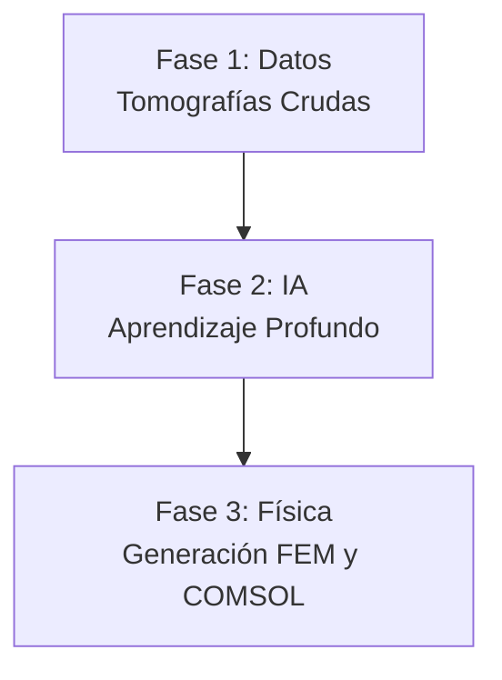

# Informe de Avance: Automatización de Pipeline Biomecánico (DICOM a Elementos Finitos)

> [!NOTE]
> **Resumen Ejecutivo**
> Este documento detalla el progreso actual en el desarrollo de un pipeline automatizado para la reconstrucción tridimensional y análisis biomecánico de estructuras óseas (pelvis y fémur). El objetivo principal del proyecto es eliminar la intervención manual que tradicionalmente toma horas por paciente, delegando la segmentación a Inteligencia Artificial y preparando las geometrías directamente para simulaciones por Elementos Finitos (FEM) en COMSOL.

---

## 1. Introducción y Problema a Resolver
En los estudios biomecánicos, extraer la geometría de los huesos a partir de Tomografías Computarizadas (CT/DICOM) es un proceso extremadamente tedioso. Un ingeniero debe "pintar" o separar manualmente el hueso del resto de los tejidos (músculo, grasa, aire). 

Para resolver esto, hemos construido una arquitectura de software inteligente que funciona como una "fábrica" o línea de ensamblaje (Pipeline). Esta fábrica toma los estudios crudos del hospital por un extremo, y devuelve mallas 3D listas para la ingeniería por el otro.

## 2. Arquitectura General del Pipeline
El sistema se ha dividido en tres grandes fases. Actualmente hemos completado y puesto en marcha las dos primeras:

### Fase 1: Creación del "Libro de Texto" para la IA (Completada)
Para que una red neuronal aprenda a reconocer huesos, primero necesita miles de ejemplos de *"esto es hueso"* y *"esto no es hueso"*. Como no teníamos estos ejemplos, programamos un sistema automatizado que los genera por nosotros.

1. **Auto-Labeler (Destilación de Conocimiento):** Utilizamos una herramienta médica llamada *TotalSegmentator* para que escaneara a 61 pacientes automáticamente (58 de ellos provenientes de una base de datos pública de internet y 3 de origen local). La decisión de utilizar tomografías de la web radica en el bajo volumen del dataset original; al exponer a la red a tomógrafos de diferentes hospitales del mundo, garantizamos que el modelo sea **generalizable** y robusto para usarse en cualquier clínica a futuro. De aquí obtuvimos las "respuestas correctas" (Ground Truth).
2. **Extracción en Parches (División 3D):** Una tomografía entera es demasiado grande para la memoria de una computadora. El código divide al paciente en miles de "cubitos" (parches de 64x64x64 píxeles).
3. **Optimización Extrema (Negative Sampling):** Como la mayoría del cuerpo humano es músculo o aire, el sistema descarta matemáticamente el 95% de los cubitos vacíos, guardando únicamente aquellos donde existe hueso. 
> [!TIP]
> **Impacto del Negative Sampling:** Esta técnica redujo el peso de los datos de entrenamiento de **180 GB a menos de 30 GB**, ahorrando muchísimo tiempo y permitiendo que la red se enfoque únicamente en aprender sobre las estructuras óseas.

### Fase 2: Entrenamiento del "Cerebro" (En Ejecución)
Actualmente, el corazón del proyecto está en plena ejecución dentro del clúster supercomputacional (OroVerde) de la Universidad.

* **La Arquitectura (UNet3D):** Estamos utilizando una Red Neuronal Convolucional 3D. Imaginemos a la red como un estudiante que mira un cubito de rayos X, intenta adivinar qué píxeles son hueso, y luego compara su respuesta con la solución correcta.
* **El Aprendizaje (Dice Loss):** Cada vez que la red se equivoca, una función matemática llamada *Dice Loss* (Pérdida de Dice) calcula el error. La red ajusta sus más de 1.4 millones de parámetros internos para intentar equivocarse un poco menos la próxima vez. 
* Este proceso se repetirá 50 veces (50 épocas) a lo largo de varios días utilizando 12 núcleos de procesamiento al máximo de su capacidad.

### Fase 3: Proyección Física y COMSOL (Próximos Pasos)
Una vez que el clúster nos devuelva el "cerebro" entrenado (un archivo `.pth`), iniciaremos la fase final.

1. **Inferencia:** Le daremos a la IA la tomografía de un paciente completamente nuevo (alguien que no haya visto antes). En cuestión de segundos, la IA identificará todo el tejido óseo de manera automática.
2. **Generación de Mallas (Meshing):** Convertiremos los píxeles identificados por la IA en una malla 3D (formato STL).
3. **Mapeo de Materiales (Propiedades Biomecánicas):** El software cruzará la malla con la densidad radiológica (Unidades Hounsfield o HU) original. Basados en la literatura biomecánica estándar (e.g., Carter & Hayes, Rho), el código traducirá la escala de grises a propiedades físicas en dos pasos:
   * **Densidad Aparente ($\rho$):** Relación lineal con las Unidades Hounsfield.
     $$\rho = a \times \text{HU} + b$$
   * **Módulo de Young / Elasticidad ($E$):** Relación potencial basada en la densidad calculada, permitiendo modelar hueso trabecular y cortical.
     $$E = C \times \rho^n$$
   *(Donde $a, b, C, n$ son constantes de calibración definidas empíricamente).*
   Esto le asignará a cada elemento o "pedacito" de hueso una rigidez específica.
4. **Exportación a COMSOL:** El modelo biomecánico completo será importado a COMSOL para simular cargas, presiones o roturas físicas.

---

## 3. Estado Actual y Conclusión
* **Datos procesados:** 61 pacientes escaneados, particionados y limpiados. Se ha reservado un conjunto estricto de pacientes y fantomas (modelos físicos) que la IA no verá durante el entrenamiento, para poder realizarle un "examen final" objetivo.
* **Cómputo:** El entrenamiento se encuentra en proceso en particiones exclusivas de alta prioridad de la FIUNER, con guardados de seguridad automáticos.
* **Proyección:** El pipeline base ha demostrado ser altamente robusto, tolerante a fallos y extremadamente eficiente en la gestión de memoria RAM y almacenamiento.
