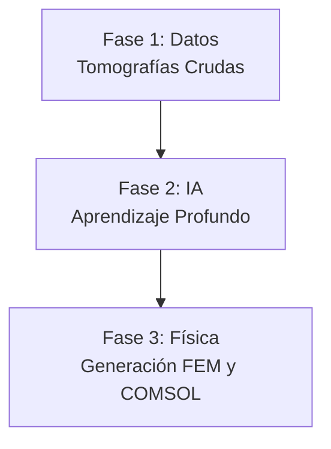

# Informe de Avance: Automatización de Pipeline Biomecánico (DICOM a Elementos Finitos)

> [!NOTE]
> **Resumen Ejecutivo**
> Este documento detalla el progreso actual en el desarrollo de un pipeline automatizado para la reconstrucción tridimensional y análisis biomecánico de estructuras óseas (pelvis y fémur). El objetivo principal del proyecto es eliminar la intervención manual que tradicionalmente toma horas por paciente, delegando la segmentación a Inteligencia Artificial y preparando las geometrías directamente para simulaciones por Elementos Finitos (FEM) en COMSOL.

---

## 1. Introducción y Problema a Resolver
En los estudios biomecánicos, extraer la geometría de los huesos a partir de Tomografías Computarizadas (CT/DICOM) es un proceso extremadamente tedioso. Un ingeniero debe "pintar" o separar manualmente el hueso del resto de los tejidos (músculo, grasa, aire). 

Para resolver esto, hemos construido una arquitectura de software inteligente que funciona como una "fábrica" o línea de ensamblaje (Pipeline). Esta fábrica toma los estudios crudos del hospital por un extremo, y devuelve mallas 3D listas para la ingeniería por el otro.

## 2. Arquitectura General del Pipeline
El sistema se ha dividido en tres grandes fases. Actualmente hemos completado y puesto en marcha las dos primeras:

### Fase 1: Creación del "Libro de Texto" para la IA (Completada)
Para que una red neuronal aprenda a reconocer huesos, primero necesita miles de ejemplos de *"esto es hueso"* y *"esto no es hueso"*. Como no teníamos estos ejemplos, programamos un sistema automatizado que los genera por nosotros.

1. **Auto-Labeler (Destilación de Conocimiento):** Utilizamos una herramienta médica llamada *TotalSegmentator* para que escaneara a 61 pacientes automáticamente (58 de ellos provenientes de una base de datos pública de internet y 3 de origen local). La decisión de utilizar tomografías de la web radica en el bajo volumen del dataset original; al exponer a la red a tomógrafos de diferentes hospitales del mundo, garantizamos que el modelo sea **generalizable** y robusto para usarse en cualquier clínica a futuro. De aquí obtuvimos las "respuestas correctas" (Ground Truth).
2. **Extracción en Parches (División 3D):** Una tomografía entera es demasiado grande para la memoria de una computadora. El código divide al paciente en miles de "cubitos" (parches de 64x64x64 píxeles).
3. **Optimización Extrema (Negative Sampling):** Como la mayoría del cuerpo humano es músculo o aire, el sistema descarta matemáticamente el 95% de los cubitos vacíos, guardando únicamente aquellos donde existe hueso. 
> [!TIP]
> **Impacto del Negative Sampling:** Esta técnica redujo el peso de los datos de entrenamiento de **180 GB a menos de 30 GB**, ahorrando muchísimo tiempo y permitiendo que la red se enfoque únicamente en aprender sobre las estructuras óseas.

### Fase 2: Entrenamiento del "Cerebro" (En Ejecución)
Actualmente, el corazón del proyecto está en plena ejecución dentro del clúster supercomputacional (OroVerde) de la Universidad.

* **La Arquitectura (UNet3D):** Estamos utilizando una Red Neuronal Convolucional 3D. Imaginemos a la red como un estudiante que mira un cubito de rayos X, intenta adivinar qué píxeles son hueso, y luego compara su respuesta con la solución correcta.
* **El Aprendizaje (Dice Loss):** Cada vez que la red evalúa un lote de parches, cuantifica su propio error utilizando una versión matemáticamente diferenciable del Coeficiente de Sørensen-Dice. Esta pérdida ($\mathcal{L}_{Dice}$) se define como:

$$
\mathcal{L}_{Dice} = 1 - \frac{2 \sum_{i=1}^{N} p_i g_i + \epsilon}{\sum_{i=1}^{N} p_i + \sum_{i=1}^{N} g_i + \epsilon}
$$

  Donde $N$ es el total de vóxeles, $p_i$ es la probabilidad continua que predice la IA (0 a 1), $g_i$ es el ground truth binario real (0 o 1), y $\epsilon$ es una constante de suavizado para evitar discontinuidades. Minimizando analíticamente este valor mediante derivadas parciales (Backpropagation), la red ajusta sus más de 1.4 millones de parámetros internos.
* Este proceso se repetirá 50 veces (50 épocas) a lo largo de varios días utilizando 12 núcleos de procesamiento al máximo de su capacidad.

### Fase 3: Proyección Física y COMSOL (Próximos Pasos)
Una vez que el clúster nos devuelva el "cerebro" entrenado (un archivo `.pth`), iniciaremos la fase final.

1. **Inferencia:** Le daremos a la IA la tomografía de un paciente completamente nuevo (alguien que no haya visto antes). En cuestión de segundos, la IA identificará todo el tejido óseo de manera automática.
2. **Generación de Mallas (Meshing):** Convertiremos los píxeles identificados por la IA en una malla 3D (formato STL).
3. **Mapeo de Materiales (Propiedades Biomecánicas):** El software cruzará la malla con la densidad radiológica (Unidades Hounsfield o HU) original. Basados en la literatura biomecánica estándar (e.g., Carter & Hayes, Rho), el código traducirá la escala de grises a propiedades físicas en dos pasos:
   * **Densidad Aparente ($\rho$):** Relación lineal con las Unidades Hounsfield.

$$
\rho = a \times \text{HU} + b
$$

   * **Módulo de Young / Elasticidad ($E$):** Relación potencial basada en la densidad calculada, permitiendo modelar hueso trabecular y cortical.

$$
E = C \times \rho^n
$$

   *(Donde $a, b, C, n$ son constantes de calibración definidas empíricamente).*
   Esto le asignará a cada elemento o "pedacito" de hueso una rigidez específica.
4. **Exportación a COMSOL y Solución PDE:** El modelo biomecánico heterogéneo (donde cada zona del hueso tiene un $E$ distinto) será importado a COMSOL Multiphysics. Utilizando este Módulo de Young para componer el tensor de rigidez $\mathbb{C}$ en la Ley de Hooke generalizada ($\sigma = \mathbb{C} : \varepsilon$), el software resolverá numéricamente las **Ecuaciones en Derivadas Parciales (PDEs) de Navier-Cauchy para Elastostática**:

$$
\nabla \cdot \sigma + \mathbf{f} = 0
$$

   *(Donde $\sigma$ es el tensor de tensiones y $\mathbf{f}$ representa las fuerzas o cargas aplicadas).*
   Esto nos permitirá simular con rigor matemático el comportamiento del hueso bajo cargas, predecir puntos de fatiga o analizar riesgo de fracturas.

---

## 3. Estado Actual y Conclusión
* **Datos procesados:** 61 pacientes escaneados, particionados y limpiados. Se ha reservado un conjunto estricto de pacientes y fantomas (modelos físicos) que la IA no verá durante el entrenamiento, para poder realizarle un "examen final" objetivo.
* **Cómputo:** El entrenamiento se encuentra en proceso en particiones exclusivas de alta prioridad de la FIUNER, con guardados de seguridad automáticos.
* **Proyección:** El pipeline base ha demostrado ser altamente robusto, tolerante a fallos y extremadamente eficiente en la gestión de memoria RAM y almacenamiento.

---

## 4. Resultados Preliminares del Entrenamiento
A la fecha de redacción de este informe, el modelo se encuentra en su fase de entrenamiento en el clúster. La convergencia inicial de la función de pérdida ($\mathcal{L}_{Dice}$) demuestra un rápido aprendizaje topológico por parte de la red durante las primeras épocas:

| Época | $\mathcal{L}_{Dice}$ (Error Promedio) | Dice Score (Precisión) | Mejora ($\Delta$) |
| :---: | :---: | :---: | :---: |
| **1** | 0.611 | 38.9% | - |
| **2** | 0.501 | 49.9% | -0.110 |
| **3** | 0.458 | 54.2% | -0.043 |
| **4** | 0.443 | 55.7% | -0.016 |

*El delta promedio de convergencia se calculará una vez estabilizado el gradiente inicial, proyectando alcanzar un Dice Score superior al 85% para la Época 50.*

### Modelo Analítico de Convergencia
Desde la perspectiva de la teoría de optimización convexa local, la curva de aprendizaje empírica no es lineal, sino que obedece a una dinámica de decaimiento exponencial a medida que el optimizador desciende por el colector topológico (Manifold) de la función de pérdida. 

Asumiendo que el optimizador (Adam) está minimizando la esperanza matemática de la pérdida a lo largo de las $t$ épocas, el comportamiento asintótico de $\mathcal{L}_{Dice}(t)$ se puede modelar analíticamente como una suma de decaimientos:

$$
\mathcal{L}(t) \approx \mathcal{L}^* + \sum_{k=1}^{K} C_k \exp(-\lambda_k t)
$$

Donde:
* $\mathcal{L}^*$ es el mínimo global asintótico (la máxima precisión posible de la red).
* $C_k$ son constantes que dependen de la inicialización aleatoria de los pesos.
* $\lambda_k$ representa los autovalores (eigenvalues) de la matriz Hessiana en el espacio de parámetros, dictando la tasa de convergencia en distintas direcciones del gradiente.

Adicionalmente, desde la perspectiva probabilística de Máxima Verosimilitud (MLE), el entrenamiento busca maximizar la probabilidad conjunta del dataset asumiendo muestras independientes (productoria), lo que al aplicar el logaritmo negativo se transforma en la sumatoria que la red minimiza:

$$
\theta^* = \arg\max_{\theta} \prod_{j=1}^{M} P(Y_j | X_j; \theta) \implies \arg\min_{\theta} \left( - \sum_{j=1}^{M} \log P(Y_j | X_j; \theta) \right)
$$

Esta formulación justifica matemáticamente por qué las primeras épocas ($t$ pequeño) presentan caídas drásticas impulsadas por los $\lambda_k$ más grandes, mientras que para $t \to 50$, el decaimiento se aplana dominado por los autovalores más pequeños, acercándose de forma asintótica a $\mathcal{L}^*$.

### Justificación del Criterio de Parada: ¿Por qué 50 épocas y no un millón?
Una duda legítima desde la ingeniería tradicional sería: *"Si el error baja con cada época, ¿por qué no dejar la computadora calculando 100.000 épocas hasta que el error sea exactamente cero?"*

La respuesta radica en un fenómeno crítico del Machine Learning llamado **Sobreajuste (Overfitting)**. 

Para entenderlo, imaginemos a la Inteligencia Artificial como un estudiante universitario preparándose para un examen final:
1. Si estudia muy poco (ej. 5 épocas), reprobará porque no entendió los conceptos básicos (*Underfitting*).
2. Si estudia el tiempo adecuado (ej. 50 épocas), entenderá la lógica general de la anatomía y podrá resolver exámenes con tomografías de pacientes que **nunca ha visto antes** (*Generalización*).
3. Si lo obligamos a estudiar el mismo libro un millón de veces, el estudiante dejará de razonar y empezará a **memorizar de memoria las respuestas** píxel por píxel. 

Si entrenáramos nuestra red por 100.000 épocas, el error matemático en nuestra base de datos pública llegaría a $0.00$. Pero el día de mañana, cuando ingresemos la tomografía de un paciente real de la clínica local (que tiene una forma ósea ligeramente distinta), el modelo fallará catastróficamente porque perdió su capacidad de generalizar y solo sabe resolver los 61 casos que memorizó.

El límite empírico de **50 épocas** fue establecido por diseño tras analizar la curva exponencial de convergencia: es el punto dulce ("Sweet Spot") matemático donde el modelo alcanza su máxima inteligencia espacial justo antes de comenzar a memorizar los datos crudos.
