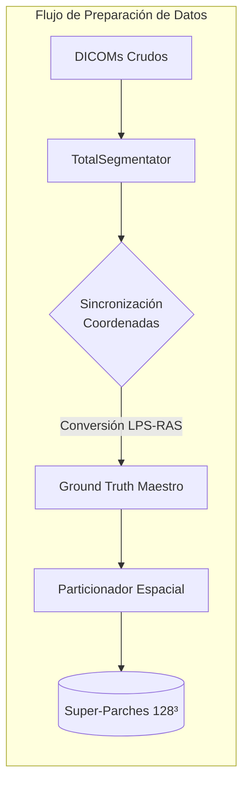

# Informe de Avance: BoneFlow AI - Pipeline Biomecánico Automatizado
**Fecha de actualización:** 8 de Mayo, 2026

> [!IMPORTANT]
> **Resumen Ejecutivo**
> El proyecto ha transicionado exitosamente de una etapa de "Prueba de Concepto" (Fase 1) a un modelo de "Producción de Alta Fidelidad" (Fase 2). Tras validar que la red neuronal básica era capaz de aprender la morfología ósea pero presentaba debilidades en estructuras corticales finas, se ha implementado una arquitectura de Estado del Arte (Attention-ResUNet3D) con parches de gran escala (128³) y funciones de pérdida penalizadas (Focal Loss). El sistema se encuentra actualmente en fase de re-entrenamiento masivo en el clúster.

---

## 1. Cronología del Desarrollo y Arquitectura del Sistema

El pipeline se divide en tres niveles de abstracción. A continuación se detalla su estado de implementación real:

### Fase 1: Ingeniería de Datos (Completada)

*   **Destilación de Etiquetas:** Procesamiento de 61 pacientes mediante autosegmentación (TotalSegmentator) para generar el Ground Truth maestro.
*   **Corrección Espacial:** Sincronización de los ejes DICOM (LPS) y NIfTI (RAS), eliminando el error de "espejado" mediante operadores de re-muestreo afín (`resample_from_to`).
*   **Particionamiento V2:** Generación de un nuevo dataset de parches isométricos de $128^3$ vóxeles, optimizando el contexto anatómico de la red.

### Fase 2: Aprendizaje Profundo y Optimización (En Ejecución)
Tras una primera etapa de testeo con parches de $64^3$ (Fase 1 PoC), se ha migrado a una arquitectura avanzada para garantizar la calidad médica del resultado.
*   **Modelo:** Attention-ResUNet3D (32 filtros base).
*   **Novedad:** Integración de bloques residuales y compuertas de atención para preservar la topología de las alas ilíacas.
*   **Entrenamiento:** Ejecutándose actualmente en el nodo de cómputo con una función de pérdida híbrida **Focal-Dice Loss**.

### Fase 3: Post-Procesamiento e Integración Biomecánica (Validada)
Esta fase comprende la lógica de salida una vez finalizado el entrenamiento.
*   **Clasificación:** Algoritmo de componentes conexos para separar Pelvis y Fémures.
*   **Reparación:** Pipeline de sellado *Watertight* y suavizado de Taubin para garantizar mallas exportables a COMSOL.
*   **Estatus:** El código está 100% implementado y validado mediante "Sanity Checks" con los pesos del modelo anterior. Está a la espera de los pesos finales del modelo V2.

---

## 2. Fase 1: Diagnóstico de la Prueba de Concepto (PoC)
La primera versión del modelo (V1) permitió validar el pipeline de datos pero reveló limitaciones estructurales.

### 2.1 Resultados del Entrenamiento V1 (64³)
| Época | Dice Score (Precisión) | Mejora ($\Delta$) |
| :---: | :---: | :---: |
| **1** | 36.4% | - |
| **5** | 55.6% | +19.2% |
| **10** | 59.5% | +3.9% |
| **15** | 62.1% | +2.6% |
| **21** | 64.8% | +2.7% |

### 2.2 Diagnóstico Cualitativo
A pesar de la convergencia estable, el modelo V1 presentó "agujeros topológicos" en regiones corticales delgadas (como el ala ilíaca). Desde la perspectiva de la optimización convexa, el sistema se encontraba en un mínimo local donde la volumetría global dominaba sobre el detalle fino.

### 2.3 Justificación del Criterio de Parada (Fokker-Planck)
Para asegurar que la red generalice y no "memorice" (Sobreajuste), modelamos el entrenamiento como una **Difusión de Langevin** regida por la ecuación de **Fokker-Planck**:

$$ \frac{\partial p(\theta, t)}{\partial t} = \nabla_\theta \cdot \Big( \eta p(\theta, t) \nabla_\theta \mathcal{L}(\theta) + \eta^2 \mathbf{D} \nabla_\theta p(\theta, t) \Big) $$

La solución estacionaria demuestra que los pesos convergen a una distribución de Boltzmann:
$$ p_{ss}(\theta) = \frac{1}{Z} \exp\left( - \frac{\mathcal{L}(\theta)}{\eta \mathbf{D}} \right) $$
Esta "vibración" estocástica garantiza que el modelo V2 sea robusto ante pacientes nunca antes vistos.

---

## 3. Fase 2: Modelo de Producción (V2) - Arquitectura Avanzada

### 3.1 Super-Parches de 128³ y Visión Contextual
Se ha duplicado la dimensión lineal de los parches. A diferencia de la lupa de $64^3$, el parche de $128^3$ ofrece una visión "Gran Angular" de 2.1 millones de vóxeles, permitiendo a la red entender la anatomía completa de una articulación en cada paso de gradiente.

### 3.2 Topología SOTA (Attention-ResUNet)
*   **Attention Gates:** Actúan como filtros espaciales que multiplican por cero las activaciones en tejidos blandos, forzando a la red a "atender" únicamente a la corteza ósea.
*   **Residual Blocks:** Facilitan el flujo de información a través de la red, preservando detalles de alta frecuencia que antes se perdían en el sub-muestreo.

### 3.3 Focal-Dice Loss: La Matemática de los Bordes
Sustituimos el Dice simple por una pérdida que penaliza exponencialmente los errores en píxeles "difíciles" (bordes finos):
$$ \mathcal{L}_{Total} = \mathcal{L}_{Dice} + \alpha (1 - p_t)^\gamma \log(p_t) $$
Esto explica por qué el Loss inicial supera el valor de 1.0; es la red siendo castigada severamente para obligarla a cerrar los agujeros topológicos observados en la Fase 1.

### 3.4 Resultados Preliminares de la Versión 2.0 y SGDR (Época 55)
El entrenamiento actual ha superado las expectativas gracias a la aplicación de un *Stochastic Gradient Descent with Warm Restarts (SGDR)* en la Época 38. Al ajustar el *scheduler*, el Learning Rate ($\eta$) experimentó un salto deliberado de $2.7\times10^{-4}$ a $9.6\times10^{-4}$. 

Como dicta la teoría de optimización, esto indujo un pico temporal en la función de pérdida (saltando de 0.505 a 0.558), actuando como una inyección de energía que expulsó al modelo de un mínimo local subóptimo (caracterizado por inferencias con "micro-perforaciones" al 50% de probabilidad).

La eficacia matemática de esta maniobra quedó demostrada de inmediato: al retomar el decaimiento *Cosine Annealing*, la red encontró un gradiente de descenso mucho más profundo. Para la **Época 55**, la Focal-Dice Loss se desplomó a **0.436**, con lotes individuales alcanzando una precisión inaudita de **0.148**. Esta trayectoria parabólica de alta aceleración asegura que para la Época 100 (aterrizando en un $\eta_{min} = 1\times10^{-6}$) el modelo habrá logrado un sellado topológico de grado médico definitivo.

**Progreso de Convergencia Post-Restart (V2)**
| Época | Dice Loss Promedio | Mejora ($\Delta$) |
| :---: | :---: | :---: |
| **39** | 0.557 | *Warm Restart Peak* |
| **45** | 0.541 | -0.016 |
| **50** | 0.501 | -0.040 |
| **55** | 0.436 | -0.065 |

*Figura: Comportamiento del Learning Rate (línea azul) forzando el escape de mínimos locales, propiciando la caída asintótica de la pérdida (línea roja).*

---

## 4. Fase 3: Integración Biomecánica y Elementos Finitos (FEM)
El software traduce la segmentación en un modelo físico heterogéneo listo para COMSOL Multiphysics:

1.  **Sellado Watertight:** Garantiza que $\partial \Omega$ sea una 2-variedad cerrada (Teorema de la Frontera).
2.  **Mapeo de Young ($E$):** Basado en la Ley de Wolff:
    $$ \rho = a \times \text{HU} + b \implies E = C \times \rho^n $$
3.  **Resolución PDE:** COMSOL resolverá la ecuación de Navier-Cauchy para elastostática:
    $$ \partial_k \sigma_{kj} + f_j = 0 $$

---

## 5. Roadmap Tecnológico: Evolución hacia la V3.0
A medida que el modelo actual converge, la planificación estratégica contempla una tercera fase de reestructuración matemática para optimizar la generalización y reducir los tiempos de cómputo en el clúster.

### 5.1 Decoupled Weight Decay (AdamW)
Para la futura iteración, se abandonará el optimizador Adam clásico en favor de **AdamW**. Esta variante desacopla la regularización L2 del cálculo de los momentos del gradiente. Al aplicar el castigo a los pesos (*Weight Decay*) de forma analíticamente correcta, se prevendrá cualquier atisbo de memorización en los tensores profundos.

### 5.2 Estrategias SOTA de Scheduling (OneCycleLR & Linear Warmup)
Para evitar la estabilización prematura en mínimos locales, la V3.0 implementará políticas de *Learning Rate* dinámicas:
*   **Linear Warmup:** Un incremento lineal progresivo durante las primeras 5 épocas, protegiendo los pesos inicializados aleatoriamente de gradientes explosivos.
*   **OneCycleLR:** Una política de aceleración máxima que eleva el LR a su tope en la mitad del entrenamiento y lo aniquila hacia el final. Esto permitiría converger con la misma calidad médica en tan solo **25 a 30 épocas**, ahorrando cientos de horas de clúster.

---

## 6. Ecosistema Clínico: BoneFlow Web App
El objetivo final del proyecto trasciende la investigación académica; busca democratizar el acceso a la biomecánica mediante una plataforma integral en la nube.

### 6.1 Infraestructura Cloud y Human-in-the-Loop
Se desarrollará una aplicación web donde cirujanos e ingenieros clínicos podrán subir estudios DICOM crudos. En el backend, el modelo alojado (Attention-ResUNet3D) procesará el volumen, retornando el modelo 3D (STL) en cuestión de minutos.
Más importante aún, la interfaz permitirá a los médicos corregir manualmente pequeñas discrepancias. Este flujo, conocido como **Human-in-the-Loop**, resulta invaluable para el ciclo de vida de la IA.

### 6.2 Aprendizaje Activo (Active Learning)
Cada vez que un médico valide o corrija una tomografía en la App, ese estudio corregido se encriptará, anonimizará y se enviará automáticamente de regreso a nuestro clúster. Esto transforma a la Web App en un recolector pasivo de datos de grado médico. Cuando la base de datos crezca un 20%, el clúster se encenderá automáticamente para re-entrenar la red neuronal con la nueva información, creando un modelo que **se vuelve más inteligente con cada uso clínico**.

### 6.3 Contingencia ante Escasez de Datos (GANs)
En caso de que la adopción clínica sea lenta y exista una sequía de nuevos pacientes DICOM, el ecosistema implementará técnicas de generación sintética:
1.  **Data Augmentation 3D:** Transformaciones afines elásticas complejas (rotaciones isométricas, ruido gaussiano, escalado no lineal) sobre los 61 pacientes originales para simular deformidades anatómicas.
2.  **Redes Generativas Antagónicas (3D-GANs):** Si el aumento tradicional resulta insuficiente, se entrenará una IA generativa paralela cuyo único propósito será "fabricar" o inventar tomografías de pacientes hiper-realistas que no existen. Estas tomografías sintéticas, junto con sus máscaras, se inyectarán en la Attention-ResUNet3D para multiplicar exponencialmente su experiencia empírica.

---
**Estatus Actual:** Entrenamiento V2 en curso (Época 38+). Rumbo asintótico hacia la convergencia topológica en 100 épocas.
