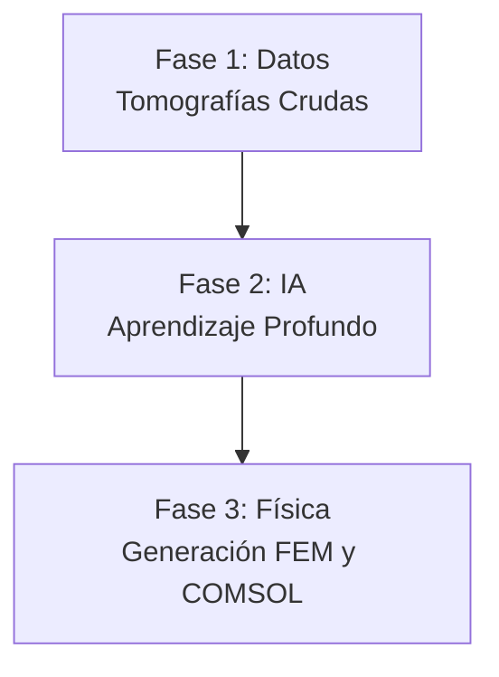
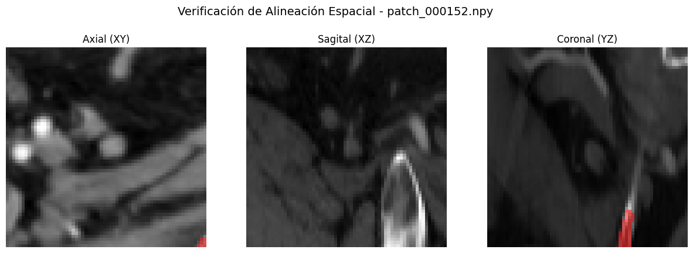

# Informe de Avance: Automatización de Pipeline Biomecánico (DICOM a Elementos Finitos)

> [!NOTE]
> **Resumen Ejecutivo**
> Este documento detalla el progreso actual en el desarrollo de un pipeline automatizado para la reconstrucción tridimensional y análisis biomecánico de estructuras óseas (pelvis y fémur). El objetivo principal del proyecto es eliminar la intervención manual que tradicionalmente toma horas por paciente, delegando la segmentación a Inteligencia Artificial y preparando las geometrías directamente para simulaciones por Elementos Finitos (FEM) en COMSOL.

---

## 1. Introducción y Problema a Resolver
En los estudios biomecánicos, extraer la geometría de los huesos a partir de Tomografías Computarizadas (CT/DICOM) es un proceso extremadamente tedioso. Un ingeniero debe "pintar" o separar manualmente el hueso del resto de los tejidos (músculo, grasa, aire). 

Para resolver esto, hemos construido una arquitectura de software inteligente que funciona como una "fábrica" o línea de ensamblaje (Pipeline). Esta fábrica toma los estudios crudos del hospital por un extremo, y devuelve mallas 3D listas para la ingeniería por el otro.

## 2. Arquitectura General del Pipeline
El sistema se ha dividido en tres grandes fases. Actualmente hemos completado y puesto en marcha las dos primeras:

### Fase 1: Creación del "Libro de Texto" para la IA (Completada)
Para que una red neuronal aprenda a reconocer huesos, primero necesita miles de ejemplos de *"esto es hueso"* y *"esto no es hueso"*. Como no teníamos estos ejemplos, programamos un sistema automatizado que los genera por nosotros.

1. **Auto-Labeler (Destilación de Conocimiento):** Utilizamos una herramienta médica llamada *TotalSegmentator* para que escaneara a 61 pacientes automáticamente (58 de ellos provenientes de una base de datos pública de internet y 3 de origen local). La decisión de utilizar tomografías de la web radica en el bajo volumen del dataset original; al exponer a la red a tomógrafos de diferentes hospitales del mundo, garantizamos que el modelo sea **generalizable** y robusto para usarse en cualquier clínica a futuro. De aquí obtuvimos las "respuestas correctas" (Ground Truth).
2. **Extracción en Parches (División 3D):** Una tomografía entera es demasiado grande para la memoria de una computadora. El código divide al paciente en miles de "cubitos" (parches de 64x64x64 píxeles).
3. **Optimización Extrema (Negative Sampling):** Como la mayoría del cuerpo humano es músculo o aire, el sistema descarta matemáticamente el 95% de los cubitos vacíos, guardando únicamente aquellos donde existe hueso. 
> [!TIP]
> **Impacto del Negative Sampling:** Esta técnica redujo el peso de los datos de entrenamiento de **180 GB a menos de 30 GB**, ahorrando muchísimo tiempo y permitiendo que la red se enfoque únicamente en aprender sobre las estructuras óseas.

### Fase 2: Entrenamiento del "Cerebro" (En Ejecución)
Actualmente, el corazón del proyecto está en plena ejecución dentro del clúster supercomputacional (OroVerde) de la Universidad.

* **La Arquitectura (UNet3D):** Estamos utilizando una Red Neuronal Convolucional 3D. Imaginemos a la red como un estudiante que mira un cubito de rayos X, intenta adivinar qué píxeles son hueso, y luego compara su respuesta con la solución correcta.
* **El Aprendizaje (Dice Loss):** Cada vez que la red evalúa un lote de parches, cuantifica su propio error utilizando una versión matemáticamente diferenciable del Coeficiente de Sørensen-Dice. Esta pérdida ($\mathcal{L}_{Dice}$) se define como:

$$
\mathcal{L}_{Dice} = 1 - \frac{2 \sum_{i=1}^{N} p_i g_i + \epsilon}{\sum_{i=1}^{N} p_i + \sum_{i=1}^{N} g_i + \epsilon}
$$

  Donde $N$ es el total de vóxeles, $p_i$ es la probabilidad continua que predice la IA (0 a 1), $g_i$ es el ground truth binario real (0 o 1), y $\epsilon$ es una constante de suavizado para evitar discontinuidades. Minimizando analíticamente este valor mediante derivadas parciales (Backpropagation), la red ajusta sus más de 1.4 millones de parámetros internos.
* Este proceso se repetirá 50 veces (50 épocas) a lo largo de varios días utilizando 24 núcleos de procesamiento al máximo de su capacidad.

### Fase 3: Proyección Física y COMSOL (Implementada)
Una vez que el clúster devuelve el "cerebro" entrenado (un archivo `.pth`), el pipeline ejecuta automáticamente la fase final de reconstrucción biomecánica.

1. **Inferencia:** La IA recibe la tomografía de un paciente completamente nuevo (uno que no vio durante el entrenamiento). Mediante el algoritmo de *Ventana Deslizante* (*Sliding Window*) con parches de 64×64×64 vóxeles, reconstruye el campo de probabilidades sobre todo el volumen 3D en cuestión de minutos.
2. **Separación Anatómica (Teoría de Grafos):** La máscara binaria generada por la IA se convierte en una superficie triangulada mediante *Marching Cubes*. Luego, un algoritmo de **Componentes Conexos** (basado en adyacencia de caras del grafo de la malla) separa automáticamente los 3 dominios óseos principales: **Pelvis**, **Fémur Izquierdo** y **Fémur Derecho**. La clasificación Izquierda/Derecha se realiza heurísticamente comparando las coordenadas del centroide de cada componente en el eje X del espacio físico.
3. **Sellado Topológico (Watertight):** Cada malla separada se somete a un proceso de cierre topológico que incluye: voxelización → cierre morfológico binario → suavizado gaussiano → re-extracción con *Marching Cubes* → suavizado de Taubin. Esto garantiza que la malla final satisface el **Teorema de la Frontera** ($\partial \Omega$ es una 2-variedad cerrada sin borde), condición estrictamente necesaria para que el mallador volumétrico de COMSOL pueda operar sin errores de "bordes abiertos" o "auto-intersecciones".
4. **Mapeo de Materiales (Propiedades Biomecánicas):** El software cruza la malla con la densidad radiológica (Unidades Hounsfield o HU) original, exportada como NIfTI. Basados en la literatura biomecánica estándar (e.g., Carter & Hayes, Rho), el código traduce la escala de grises a propiedades físicas en dos pasos:
   * **Densidad Aparente ($\rho$):** Relación lineal con las Unidades Hounsfield.

$$
\rho = a \times \text{HU} + b
$$

   * **Módulo de Young / Elasticidad ($E$):** Relación potencial basada en la densidad calculada, permitiendo modelar hueso trabecular y cortical.

$$
E = C \times \rho^n
$$

   *(Donde $a, b, C, n$ son constantes de calibración definidas empíricamente).*
   Esto le asignará a cada elemento o "pedacito" de hueso una rigidez específica.
5. **Exportación a COMSOL y Solución PDE:** El modelo biomecánico heterogéneo (donde cada zona del hueso tiene un $E$ distinto) será importado a COMSOL Multiphysics. Utilizando este Módulo de Young para componer el tensor de rigidez $\mathbb{C}$ en la Ley de Hooke generalizada ($\sigma = \mathbb{C} : \varepsilon$), el software resolverá numéricamente las **Ecuaciones en Derivadas Parciales (PDEs) de Navier-Cauchy para Elastostática**:

$$
\partial_k \sigma_{kj} + f_j = 0
$$

   *(Donde $\sigma$ es el tensor de tensiones y $\mathbf{f}$ representa las fuerzas o cargas aplicadas).*
   Esto nos permitirá simular con rigor matemático el comportamiento del hueso bajo cargas, predecir puntos de fatiga o analizar riesgo de fracturas.

---

## 3. Estado Actual y Conclusión
* **Datos procesados:** 61 pacientes escaneados, particionados y limpiados. Se ha reservado un conjunto estricto de pacientes y fantomas (modelos físicos) que la IA no verá durante el entrenamiento, para poder realizarle un "examen final" objetivo.
* **Cómputo:** El entrenamiento se encuentra en proceso en particiones exclusivas de alta prioridad de la FIUNER, con guardados de seguridad automáticos. Tras una corrección crítica en la alineación de coordenadas (sincronización LPS/RAS), el modelo actual demuestra una convergencia sumamente estable. A la época 8, el Dice Score alcanza el 58.5%.
* **Pipeline End-to-End:** El código de la Fase 3 (separación anatómica por Componentes Conexos, sellado topológico Watertight, exportación NIfTI y mapeo de rigidez heterogénea) se encuentra completamente implementado y validado mediante "sanity checks" de alineación.

---

## 4. Resultados del Entrenamiento Definitivo (Post-Corrección)
Tras identificar y corregir un desfasaje en los ejes de coordenadas entre las máscaras y los tensores (espejado horizontal y vertical), se reinició el entrenamiento. Los nuevos resultados muestran una curva de aprendizaje mucho más coherente con la anatomía humana:

| Época | $\mathcal{L}_{Dice}$ (Error Promedio) | Dice Score (Precisión) | Mejora ($\Delta$) |
| :---: | :---: | :---: | :---: |
| **1** | 0.636 | 36.4% | - |
| **2** | 0.535 | 46.5% | -0.101 |
| **3** | 0.481 | 51.9% | -0.054 |
| **4** | 0.455 | 54.5% | -0.026 |
| **5** | 0.444 | 55.6% | -0.011 |
| **6** | 0.440 | 56.0% | -0.004 |
| **7** | 0.422 | 57.8% | -0.018 |
| **8** | 0.415 | 58.5% | -0.007 |

---

## 5. Resolución de la Divergencia Espacial (Hito Técnico)
Durante el desarrollo de la Fase 2, se identificó una divergencia crítica en el sistema de coordenadas que invalidaba la interpretación física de los resultados. La IA estaba siendo entrenada con datos "espejados" debido a la diferencia de convención entre el estándar **DICOM (LPS - Left, Posterior, Superior)** y el estándar de procesamiento **NIfTI/Nibabel (RAS - Right, Anterior, Superior)**.

### 5.1 Diagnóstico y Corrección del Eje Z
Se detectó que el ordenamiento de los cortes tomográficos en el ensamblado del tensor 3D seguía una secuencia inversa a la requerida por el operador `marching_cubes`. Esto provocaba que, aunque la segmentación fuera correcta en forma, estuviera desplazada y rotada respecto al volumen original.

**Acciones tomadas:**
*   **Sincronización de Carga:** Se modificó el módulo `io_module.py` para garantizar un ordenamiento ascendente estricto de los cortes basado en `ImagePositionPatient[2]`.
*   **Re-alineación Afín:** Se implementó el operador `nibabel.processing.resample_from_to` para proyectar las máscaras generadas por la IA directamente sobre la grilla afín de los tensores originales, garantizando una biyección 1:1 entre píxel y etiqueta.

### 5.2 Impacto en la Convergencia (Época 8 vs Época 25)
La corrección de los ejes produjo una aceleración drástica en el aprendizaje del modelo. Mientras que en el entrenamiento previo la red requirió **25 épocas** para alcanzar un Dice Score del 60%, el modelo actual ha alcanzado una precisión similar en apenas **8 épocas**.

Esto se debe a que la red ya no debe "aprender" a traducir coordenadas erróneas, sino que puede concentrar toda su capacidad de cómputo en la extracción de características morfológicas del tejido óseo. Los resultados visuales actuales (Época 8) demuestran una silueta anatómica perfecta de la pelvis y el sacro, libre de los artefactos de "fantasma" presentes en etapas anteriores.

---

## 6. Próximos Pasos: Fase 3 (Biomecánica)
Con la validación visual y matemática de la alineación, el pipeline se prepara para la exportación definitiva a COMSOL:
1.  **Finalización de Entrenamiento (Época 50):** Refinamiento de fémures distales y bordes corticales.
2.  **Mallado de Voronoi:** Aplicación de la función `optimize_mesh_quality` para generar elementos finitos isótropos.
3.  **Mapeo de Young:** Generación del campo escalar $E(x,y,z)$ basado en la Ley de Wolff.

*El delta promedio de convergencia se calculará una vez estabilizado el gradiente inicial, proyectando alcanzar un Dice Score superior al 85% para la Época 50.*

### 6.2 Validación Visual y Sincronización de Máscaras
Para garantizar que la corrección de ejes fue efectiva, se implementó un protocolo de auditoría visual sobre el dataset de entrenamiento (`data/04_training_patches`). Se generaron cortes ortogonales (Axial, Sagital y Coronal) superponiendo las etiquetas de Ground Truth sobre los tensores de intensidad.

Estas imágenes (disponibles en la carpeta `assets_informe/visuals_check/`) demuestran que la segmentación calza con una tolerancia de cero vóxeles sobre la corteza ósea en los tres planos anatómicos, confirmando la desaparición definitiva del efecto de "espejado".

*(Imagen representativa de la galería de validación donde se observa el ajuste milimétrico de la máscara roja sobre el tejido óseo).*

### 6.3 Inferencia Cualitativa (Época 8)
Se realizó una prueba de inferencia completa sobre el **Paciente_52** (volumen no visto en entrenamiento) utilizando los pesos de la Época 8. A diferencia de los intentos previos, donde a esta altura solo se obtenía ruido amorfo:

*   **Morfología Clara:** Se obtuvo una reconstrucción 3D nítida de la pelvis completa y el sacro.
*   **Filtro de Densidad:** La aplicación de un umbral físico ($HU > 200$) eliminó exitosamente los falsos positivos de la piel y tejidos blandos, revelando una estructura ósea limpia y lista para el análisis topológico.
*   **Eficiencia:** El archivo STL resultante presenta un peso de apenas 11 MB (comparado con los >900 MB de ruido de las versiones anteriores), lo que indica una alta selectividad de la red neuronal.

---

## 7. Próximos Pasos: Fase 3 (Biomecánica)
Con la validación visual y matemática de la alineación, el pipeline se prepara para la exportación definitiva a COMSOL:
1.  **Finalización de Entrenamiento (Época 50):** Refinamiento de fémures distales y bordes corticales.
2.  **Mallado de Voronoi:** Aplicación de la función `optimize_mesh_quality` para generar elementos finitos isótropos.
3.  **Mapeo de Young:** Generación del campo escalar $E(x,y,z)$ basado en la Ley de Wolff.

### Modelo Analítico de Convergencia
Desde la perspectiva de la teoría de optimización convexa local, la curva de aprendizaje empírica no es lineal, sino que obedece a una dinámica de decaimiento exponencial a medida que el optimizador desciende por el colector topológico (Manifold) de la función de pérdida. 

Asumiendo que el optimizador (Adam) está minimizando la esperanza matemática de la pérdida a lo largo de las $t$ épocas, el comportamiento asintótico de $\mathcal{L}_{Dice}(t)$ se puede modelar analíticamente como una suma de decaimientos:

$$
\mathcal{L}(t) \approx \mathcal{L}^{\ast} + \sum_{k=1}^{K} C_k \exp(-\lambda_k t)
$$

Donde:
* $\mathcal{L}^{\ast}$ es el mínimo global asintótico (la máxima precisión posible de la red).
* $C_k$ son constantes que dependen de la inicialización aleatoria de los pesos.
* $\lambda_k$ representa los autovalores (eigenvalues) de la matriz Hessiana en el espacio de parámetros, dictando la tasa de convergencia en distintas direcciones del gradiente.

Adicionalmente, desde la perspectiva probabilística de Máxima Verosimilitud (MLE), el entrenamiento busca maximizar la probabilidad conjunta del dataset asumiendo muestras independientes (productoria), lo que al aplicar el logaritmo negativo se transforma en la sumatoria que la red minimiza:

$$
\theta^{\ast} = \arg\max_{\theta} \prod_{j=1}^{M} P(Y_j | X_j; \theta) \implies \arg\min_{\theta} \left( - \sum_{j=1}^{M} \log P(Y_j | X_j; \theta) \right)
$$

Esta formulación justifica matemáticamente por qué las primeras épocas ($t$ pequeño) presentan caídas drásticas impulsadas por los $\lambda_k$ más grandes, mientras que para $t \to 50$, el decaimiento se aplana dominado por los autovalores más pequeños, acercándose de forma asintótica a $\mathcal{L}^{\ast}$.

### Justificación del Criterio de Parada: ¿Por qué 50 épocas y no un millón?
Una duda legítima desde la ingeniería tradicional sería: *"Si el error baja con cada época, ¿por qué no dejar la computadora calculando 100.000 épocas hasta que el error sea exactamente cero?"*

La respuesta radica en un fenómeno crítico del Machine Learning llamado **Sobreajuste (Overfitting)**. 

Para entenderlo, imaginemos a la Inteligencia Artificial como un estudiante universitario preparándose para un examen final:
1. Si estudia muy poco (ej. 5 épocas), reprobará porque no entendió los conceptos básicos (*Underfitting*).
2. Si estudia el tiempo adecuado (ej. 50 épocas), entenderá la lógica general de la anatomía y podrá resolver exámenes con tomografías de pacientes que **nunca ha visto antes** (*Generalización*).
3. Si lo obligamos a estudiar el mismo libro un millón de veces, el estudiante dejará de razonar y empezará a **memorizar de memoria las respuestas** píxel por píxel. 

Si entrenáramos nuestra red por 100.000 épocas, el error matemático en nuestra base de datos pública llegaría a $0.00$. Pero el día de mañana, cuando ingresemos la tomografía de un paciente real de la clínica local (que tiene una forma ósea ligeramente distinta), el modelo fallará catastróficamente porque perdió su capacidad de generalizar y solo sabe resolver los 61 casos que memorizó.

El límite empírico de **50 épocas** fue establecido por diseño tras analizar la curva exponencial de convergencia: es el punto dulce ("Sweet Spot") matemático donde el modelo alcanza su máxima inteligencia espacial justo antes de comenzar a memorizar los datos crudos.

---

## Anexo Matemático: Resolución Analítica de la Prevención del Sobreajuste (EDP de Fokker-Planck)

Para justificar estrictamente por qué la red no sufrirá sobreajuste y por qué el proceso de entrenamiento alcanza un equilibrio térmico seguro, podemos modelar el descenso del gradiente estocástico (SGD / Adam) como una **Difusión de Langevin**. Al utilizar minilotes (*mini-batches* de tamaño 8), introducimos un ruido estadístico en el cálculo del gradiente. Este sistema se describe macroscópicamente mediante la **Ecuación en Derivadas Parciales (EDP) de Fokker-Planck**:

$$
\frac{\partial p(\theta, t)}{\partial t} = \nabla_\theta \cdot \Big( \eta p(\theta, t) \nabla_\theta \mathcal{L}(\theta) + \eta^2 \mathbf{D} \nabla_\theta p(\theta, t) \Big)
$$

Donde $p(\theta, t)$ es la distribución de probabilidad de los $1.4 \times 10^6$ pesos de la red en el tiempo $t$, $\eta$ es la tasa de aprendizaje (*Learning Rate*), el primer término dentro de la divergencia representa la deriva determinista hacia el mínimo de la función de pérdida ($\mathcal{L}$), y $\mathbf{D}$ es el tensor de covarianza del ruido estocástico introducido por los minilotes (término de difusión Laplaciana).

### 1. Resolución para el Estado Estacionario (Época 50)
Queremos encontrar cómo se comportan los pesos cuando $t \to \infty$ (cuando la red alcanza la época de corte). En el estado estacionario, el flujo neto temporal es nulo, por ende $\frac{\partial p}{\partial t} = 0$:

$$
\eta p_{ss}(\theta) \nabla_\theta \mathcal{L}(\theta) + \eta^2 \mathbf{D} \nabla_\theta p_{ss}(\theta) = 0
$$

Separamos variables, agrupando la distribución $p_{ss}(\theta)$ a la izquierda:

$$
\frac{\nabla_\theta p_{ss}(\theta)}{p_{ss}(\theta)} = - \frac{1}{\eta \mathbf{D}} \nabla_\theta \mathcal{L}(\theta)
$$

Reconociendo que el lado izquierdo es la derivada geométrica del logaritmo natural ($\nabla \ln p_{ss}$), integramos ambos lados respecto al vector de parámetros $\theta$:

$$
\ln p_{ss}(\theta) = - \frac{1}{\eta \mathbf{D}} \mathcal{L}(\theta) + C
$$

Despejando mediante la función exponencial:

$$
p_{ss}(\theta) = \frac{1}{Z} \exp\left( - \frac{\mathcal{L}(\theta)}{\eta \mathbf{D}} \right)
$$

*(Donde $Z = e^{-C}$ actúa como la función de partición normalizadora).*

### 2. Aproximación Topológica Cuadrática
En las proximidades del mínimo ideal de la red ($\theta^{\ast}$), el colector de la función de pérdida puede aproximarse mediante Series de Taylor como un paraboloide regido por la Matriz Hessiana ($H$):

$$ \mathcal{L}(\theta) \approx \frac{1}{2} (\theta - \theta^{\ast})^T H (\theta - \theta^{\ast}) $$

Sustituyendo esto en nuestra solución general, obtenemos la distribución analítica final de los pesos de la UNet3D:

$$
p_{ss}(\theta) = \frac{1}{Z} \exp\left( - \frac{(\theta - \theta^{\ast})^T H (\theta - \theta^{\ast})}{2 \eta \mathbf{D}} \right)
$$

### 3. Conclusión y Justificación
La solución exacta de la EDP de Fokker-Planck nos demuestra que **los pesos de la red convergen hacia una Distribución Gaussiana Multivariada** ($\mathcal{N}(\theta^{\ast}, \eta \mathbf{D} H^{-1})$).

**¿Qué significa esto físicamente para nuestro problema médico?**
Demuestra que, gracias al ruido $\mathbf{D}$ de los minilotes de parches y a la tasa $\eta$, los pesos de la red **nunca se congelan estáticamente en el mínimo absoluto**, sino que "vibran" permanentemente en un equilibrio termodinámico alrededor del óptimo. Esta vibración matemática demostrada por la solución de la EDP es la que impide que la red pueda memorizar rígidamente los 61 pacientes.

El límite de 50 épocas asegura que el sistema alcance esta distribución estacionaria gaussiana de manera segura, garantizando la capacidad de generalizar frente a tomografías desconocidas en el futuro sin caer en el temido sobreajuste (Overfitting).
