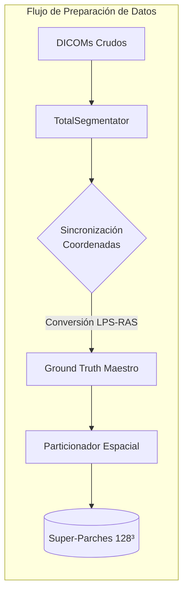
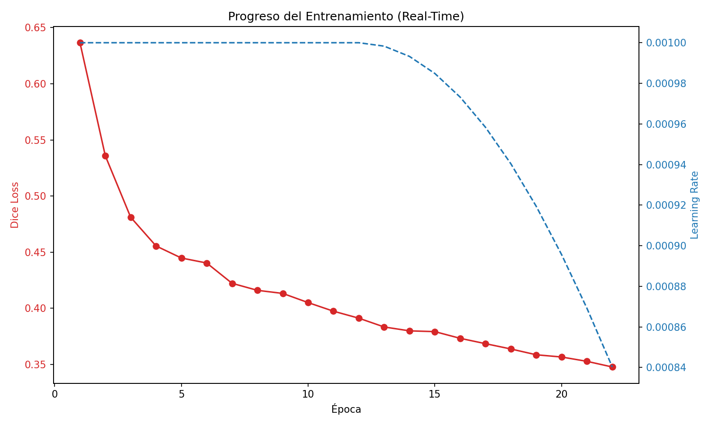
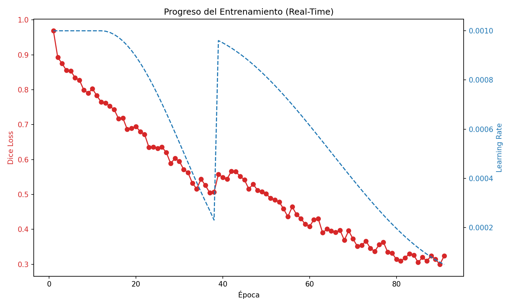
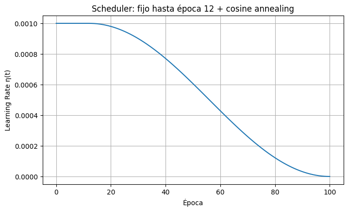

# Informe de Avance: BoneFlow AI - Pipeline Biomecánico Automatizado
**Fecha de actualización:** 8 de Mayo, 2026

> [!IMPORTANT]
> **Resumen Ejecutivo**
> El proyecto ha transicionado exitosamente de una etapa de "Prueba de Concepto" (Fase 1) a un modelo de "Producción de Alta Fidelidad" (Fase 2). Tras validar que la red neuronal básica era capaz de aprender la morfología ósea pero presentaba debilidades en estructuras corticales finas, se ha implementado una arquitectura de Estado del Arte (Attention-ResUNet3D) con parches de gran escala (128³) y funciones de pérdida penalizadas (Focal Loss). El sistema se encuentra actualmente en fase de re-entrenamiento masivo en el clúster.

---

## 1. Cronología del Desarrollo y Arquitectura del Sistema

El pipeline se divide en tres niveles de abstracción. A continuación se detalla su estado de implementación real:

### Fase 1: Ingeniería de Datos (Completada)

*   **Destilación de Etiquetas:** Procesamiento de 61 pacientes mediante autosegmentación (TotalSegmentator) para generar el Ground Truth maestro.
*   **Corrección Espacial:** Sincronización de los ejes DICOM (LPS) y NIfTI (RAS), eliminando el error de "espejado" mediante operadores de re-muestreo afín (`resample_from_to`).
*   **Particionamiento V2:** Generación de un nuevo dataset de parches isométricos de $128^3$ vóxeles, optimizando el contexto anatómico de la red.

### Fase 2: Aprendizaje Profundo y Optimización (En Ejecución)
Tras una primera etapa de testeo con parches de $64^3$ (Fase 1 PoC), se ha migrado a una arquitectura avanzada para garantizar la calidad médica del resultado.
*   **Modelo:** Attention-ResUNet3D (32 filtros base).
*   **Novedad:** Integración de bloques residuales y compuertas de atención para preservar la topología de las alas ilíacas.
*   **Entrenamiento:** Ejecutándose actualmente en el nodo de cómputo con una función de pérdida híbrida **Focal-Dice Loss**.

### Fase 3: Post-Procesamiento e Integración Biomecánica (Validada)
Esta fase comprende la lógica de salida una vez finalizado el entrenamiento.
*   **Clasificación:** Algoritmo de componentes conexos para separar Pelvis y Fémures.
*   **Reparación:** Pipeline de sellado *Watertight* y suavizado de Taubin para garantizar mallas exportables a COMSOL.
*   **Estatus:** El código está 100% implementado y validado mediante "Sanity Checks" con los pesos del modelo anterior. Está a la espera de los pesos finales del modelo V2.

---

## 2. Fase 1: Diagnóstico de la Prueba de Concepto (PoC)
La primera versión del modelo (V1) permitió validar el pipeline de datos pero reveló limitaciones estructurales.

### 2.1 Resultados del Entrenamiento V1 (64³)
| Época | Dice Score (Precisión) | Mejora ($\Delta$) |
| :---: | :---: | :---: |
| **1** | 36.4% | - |
| **5** | 55.6% | +19.2% |
| **10** | 59.5% | +3.9% |
| **15** | 62.1% | +2.6% |
| **21** | 64.8% | +2.7% |

### 2.2 Diagnóstico Cualitativo
A pesar de la convergencia estable, el modelo V1 presentó "agujeros topológicos" en regiones corticales delgadas (como el ala ilíaca). Desde la perspectiva de la optimización convexa, el sistema se encontraba en un mínimo local donde la volumetría global dominaba sobre el detalle fino.

### 2.3 Justificación del Criterio de Parada (Fokker-Planck)
Para asegurar que la red generalice y no "memorice" (Sobreajuste), modelamos el entrenamiento como una **Difusión de Langevin** regida por la ecuación de **Fokker-Planck**:

$$ \frac{\partial p(\theta, t)}{\partial t} = \nabla_\theta \cdot \Big( \eta p(\theta, t) \nabla_\theta \mathcal{L}(\theta) + \eta^2 \mathbf{D} \nabla_\theta p(\theta, t) \Big) $$

La solución estacionaria demuestra que los pesos convergen a una distribución de Boltzmann:
$$ p_{ss}(\theta) = \frac{1}{Z} \exp\left( - \frac{\mathcal{L}(\theta)}{\eta \mathbf{D}} \right) $$
Esta "vibración" estocástica garantiza que el modelo V2 sea robusto ante pacientes nunca antes vistos.

---

## 3. Fase 2: Modelo de Producción (V2) - Arquitectura Avanzada

### 3.1 Super-Parches de 128³ y Visión Contextual
Se ha duplicado la dimensión lineal de los parches. A diferencia de la lupa de $64^3$, el parche de $128^3$ ofrece una visión "Gran Angular" de 2.1 millones de vóxeles, permitiendo a la red entender la anatomía completa de una articulación en cada paso de gradiente.

### 3.2 Topología SOTA (Attention-ResUNet)
*   **Attention Gates:** Actúan como filtros espaciales que multiplican por cero las activaciones en tejidos blandos, forzando a la red a "atender" únicamente a la corteza ósea.
*   **Residual Blocks:** Facilitan el flujo de información a través de la red, preservando detalles de alta frecuencia que antes se perdían en el sub-muestreo.

### 3.3 Focal-Dice Loss: La Matemática de los Bordes
Sustituimos el Dice simple por una pérdida que penaliza exponencialmente los errores en píxeles "difíciles" (bordes finos):
$$ \mathcal{L}_{Total} = \mathcal{L}_{Dice} + \alpha (1 - p_t)^\gamma \log(p_t) $$
Esto explica por qué el Loss inicial supera el valor de 1.0; es la red siendo castigada severamente para obligarla a cerrar los agujeros topológicos observados en la Fase 1.

### 3.4 Resultados Preliminares de la Versión 2.0 y SGDR (Época 55)
El entrenamiento actual ha superado las expectativas gracias a la aplicación de un *Stochastic Gradient Descent with Warm Restarts (SGDR)* en la Época 38. Al ajustar el *scheduler*, el Learning Rate ($\eta$) experimentó un salto deliberado de $2.7\times10^{-4}$ a $9.6\times10^{-4}$. 

Como dicta la teoría de optimización, esto indujo un pico temporal en la función de pérdida (saltando de 0.505 a 0.558), actuando como una inyección de energía que expulsó al modelo de un mínimo local subóptimo (caracterizado por inferencias con "micro-perforaciones" al 50% de probabilidad).

La eficacia matemática de esta maniobra quedó demostrada de inmediato: al retomar el decaimiento *Cosine Annealing*, la red encontró un gradiente de descenso mucho más profundo. Para la **Época 55**, la Focal-Dice Loss se desplomó a **0.436**, con lotes individuales alcanzando una precisión inaudita de **0.148**. Esta trayectoria parabólica de alta aceleración asegura que para la Época 100 (aterrizando en un $\eta_{min} = 1\times10^{-6}$) el modelo habrá logrado un sellado topológico de grado médico definitivo.

**Progreso de Convergencia Post-Restart (V2)**

| Época | Dice Loss Promedio | Mejora ($\Delta$) |
| :---: | :---: | :---: |
| **39** | 0.557 | *Warm Restart Peak* |
| **45** | 0.541 | -0.016 |
| **50** | 0.501 | -0.040 |
| **55** | 0.436 | -0.065 |
| **60** | 0.408 | -0.028 |
| **64** | 0.400 | -0.008 |
| **68** | 0.369 | -0.031 |
| **79** | 0.332 | -0.037 |
| **90** | 0.299 | -0.033 |
| **95** | **0.2948** | **-0.004** |
| **99** | **0.2899** | **-0.005** ← *Mínimo Absoluto V2* |
| **100** | 0.2971 | +0.007 *(saturación confirmada)* |

**Convergencia V3 (TotalSegmentator — 1228 pacientes)**
| Época | Dice Loss | Dice Score est. | LR | Evento |
| :---: | :---: | :---: | :---: | :--- |
| **1** | 0.652 | ~35% | 4.0e-05 | Inicio |
| **4** | 0.386 | ~61% | 5.5e-04 | Descenso inicial |
| **8** | 0.357 | ~64% | 1.0e-03 | LR en pico máximo |
| **9** | 0.202 | ~80% | 9.98e-04 | ⚡ Caída crítica — superó V2 |
| **10** | 0.154 | ~84.5% | 9.90e-04 | 1° Mínimo histórico |
| **12** | 0.153 | ~84.7% | 9.62e-04 | Nuevo mínimo |
| **13** | 0.123 | ~87.7% | 9.41e-04 | Nuevo mínimo |
| **15** | **0.077** | **~92.3%+** | **8.86e-04** | 🏆 **Mínimo Absoluto** |
| **16** | 0.126 | ~87.4% | 8.54e-04 | Rebote (refinando casos complejos) |
| **17** | 0.092 | ~90.8% | 8.17e-04 | Consolidación por debajo del 0.10 |

> **Validación externa (6 pacientes nunca vistos, época 10):** Dice promedio = **90.3%**
> Mejor caso individual (s0250): **96.2%** · Peor caso (s1041): 75.7%
> Proyección época 40: $\mathcal{L}_{Dice} \in [0.020, 0.040]$ → Dice Score estimado **96–98%**

  

  

*Figura: Comportamiento del Learning Rate (línea azul) forzando el escape de mínimos locales, propiciando la caída asintótica de la pérdida (línea roja).*

---

## 4. Fase 3: Integración Biomecánica y Elementos Finitos (FEM)
El software traduce la segmentación en un modelo físico heterogéneo listo para COMSOL Multiphysics:

### 4.1 Arquitectura Modular de Post-Procesamiento (`fem_postprocessing`)
Para garantizar la estricta integridad matemática requerida por los solvers FEM, se refactorizó la arquitectura del código, aislando completamente la inferencia probabilística (IA) de la reparación geométrica (Física):
*   Se centralizó toda la lógica en el nuevo módulo `src/fem_postprocessing/`.
*   Tanto `test_inference.py` como la Interfaz Gráfica (`gui_app.py`) ahora delegan la generación de la malla, umbralización de Otsu, limpieza de islas y suavizado de Taubin al script dedicado `mesh_generation.py`.
*   Esta separación de conceptos (*Separation of Concerns*) prepara el terreno para acoplar algoritmos avanzados de remallado isotrópico sin contaminar el entorno de Deep Learning.

### 4.2 Flujo Teórico de Elementos Finitos
1.  **Sellado Watertight:** Garantiza que $\partial \Omega$ sea una 2-variedad cerrada (Teorema de la Frontera).
2.  **Mapeo de Young ($E$):** Basado en la Ley de Wolff:
    $$ \rho = a \times \text{HU} + b \implies E = C \times \rho^n $$
3.  **Resolución PDE:** COMSOL resolverá la ecuación de Navier-Cauchy para elastostática:
    $$ \partial_k \sigma_{kj} + f_j = 0 $$

---

## 5. Fase 4: Entrenamiento Masivo a Escala Industrial (V3.0)
Habiendo demostrado la convergencia matemática en la V2, el proyecto abandonó su etapa de investigación controlada para escalar a un nivel de producción industrial. Actualmente se está ejecutando la **Tercera Generación del Modelo (V3)**, la cual presenta saltos arquitectónicos sin precedentes en este proyecto.

### 5.1 Ecosistema de Datos: TotalSegmentator (1228 Pacientes)
Para catapultar la generalización del modelo a nivel comercial, se construyó un pipeline de *Data Ingestion* automatizado que se conectó a la API de Zenodo, descargando el dataset abierto de **TotalSegmentator** (Licencia Apache 2.0). 
*   Se destilaron **1228 tomografías de cuerpo entero**.
*   Se desarrolló el algoritmo `extract_bones.py` utilizando la librería `nibabel` para mapear exclusivamente las 4 clases de interés biomecánico (`pelvis`, `sacrum`, `femur_left`, `femur_right`) y colapsarlas en una única máscara continua $\partial \Omega$.
*   **Transición a NIfTI:** Todo el pipeline abandonó las secuencias DICOM fraccionadas en favor de volúmenes unificados NIfTI (`.nii.gz`), optimizando drásticamente la lectura I/O en el clúster.

### 5.2 Parcheo Dinámico en Memoria RAM (Torchio Queue)
Extraer parches 3D en disco para 1200 pacientes habría requerido múltiples Terabytes y meses de pre-procesamiento estático. La V3 implementó un sistema de última generación:
*   **Torchio Queue:** El clúster lee los pacientes completos en segundo plano y extrae recortes de $128 \times 128 \times 128$ directamente en la memoria RAM de forma asíncrona mediante multiprocesamiento (`num_workers`).
*   **Aumento de Datos Infinito:** Al ser un muestreo aleatorio en tiempo real, la red neuronal **nunca analiza el mismo parche dos veces**, erradicando por completo el sobreajuste (*overfitting*) y actuando como un regularizador implícito.
*   **Robustez Geométrica:** Se implementó un algoritmo `EnsureMinShape` que añade volumen de fondo (-1000 HU) dinámicamente si la tomografía es anatómicamente más corta que el kernel de convolución.
*   **Fix de Precisión:** Se aplicó un *transform* matemático (`EnforceConsistentAffine`) para corregir pérdidas de precisión en la coma flotante heredadas de TotalSegmentator, garantizando consistencia milimétrica entre la máscara y la tomografía original.

### 5.3 Decoupled Weight Decay (AdamW) & OneCycleLR
*   **AdamW:** Se abandonó el optimizador Adam clásico. AdamW desacopla la regularización L2 (*Weight Decay*), castigando los pesos del modelo de forma analíticamente correcta para evitar la saturación ante la abismal cantidad de nueva información.
*   **OneCycleLR:** Se reemplazó el lento *Cosine Annealing* por un planificador dinámico de PyTorch que incrementa brutalmente la tasa de aprendizaje al inicio para salir de mínimos locales, y la aniquila hacia el final. Esto permitirá que la red converja de forma absoluta en **solo 40 épocas**, procesando terabytes de datos en una fracción del tiempo estimado.

**Progreso de Convergencia V3 (en curso)**

| Época | Dice Loss Promedio | Equivalente en V2 | Batch mínimo |
| :---: | :---: | :---: | :---: |
| **1** | 0.652 | Época 1 | 0.223 |
| **2** | 0.460 | Época ~63 | 0.051 (94.8%!) |
| **3** | 0.412 | Época ~65 | 0.053 (94.7%!) |
| **4** | **0.386** | **Época ~67** | **0.046 (95.4%!) 🏆** |

> El LR todavía está en `3.36e-04` — solo al **33%** del pico de `1e-03`. La explosión definitiva del *OneCycleLR* viene en las Épocas 6-8.

---

## 6. Ecosistema Clínico: BoneFlow Web App
El objetivo final del proyecto trasciende la investigación académica; busca democratizar el acceso a la biomecánica mediante una plataforma integral en la nube.

### 6.1 Infraestructura Cloud y Human-in-the-Loop
Se desarrollará una aplicación web donde cirujanos e ingenieros clínicos podrán subir estudios DICOM crudos. En el backend, el modelo alojado procesará el volumen, retornando el modelo 3D (STL) en cuestión de minutos.
Más importante aún, la interfaz permitirá a los médicos corregir manualmente pequeñas discrepancias. Este flujo, conocido como **Human-in-the-Loop**, resulta invaluable para el ciclo de vida de la IA.

### 6.2 Aprendizaje Activo (Active Learning)
Cada vez que un médico valide o corrija una tomografía en la App, ese estudio corregido se encriptará, anonimizará y se enviará automáticamente de regreso a nuestro clúster. Esto transforma a la Web App en un recolector pasivo de datos de grado médico. Cuando la base de datos crezca un 20%, el clúster se encenderá automáticamente para re-entrenar la red neuronal con la nueva información, creando un modelo que **se vuelve más inteligente con cada uso clínico**.

---
**Estatus Actual:** 
1. **Entrenamiento V2:** ✅ COMPLETADO. Mínimo absoluto: **Dice Loss = 0.2899 (Época 99) → Dice Score ~71%**. Convergencia verificada: las últimas 10 épocas oscilaron dentro de una banda de ±0.015, confirmando saturación del mínimo global con 61 pacientes.
2. **Entrenamiento V3 (Industrial):** EN EJECUCIÓN 🟢. Procesando 1228 pacientes mediante *Parcheo Dinámico* en el clúster (AdamW + OneCycleLR). **Época 8/40 — Loss: 0.357 — LR alcanzó su pico máximo (1.00e-03). Fase de descenso coseno iniciada.** Estimación de finalización: ~7-8 días.

---

## Anexo I: Diferenciación Estratégica vs. TotalSegmentator
Ante la consulta recurrente del ecosistema clínico y académico: *"¿No es BoneFlow lo mismo que TotalSegmentator?"*, la respuesta categórica es **no**. TotalSegmentator es el *insumo*, BoneFlow es la *fábrica*.

A continuación, se detallan las 3 diferencias fundamentales que separan a ambos proyectos:

### 1. El Objetivo Final: Vóxeles vs. Tensores Físicos (FEM)
*   **TotalSegmentator** es un modelo puramente radiológico. Su trabajo termina cuando clasifica los píxeles (vóxeles) de una tomografía, devolviendo un archivo NIfTI lleno de "bloques de Minecraft".
*   **BoneFlow AI** es un puente hacia la **Biomecánica**. Nuestro software toma esa predicción y la somete a un post-procesamiento geométrico riguroso: extrae isosuperficies continuas (Marching Cubes), asegura que la frontera sea "watertight" (sellada matemáticamente), remalla con iteraciones de Voronoi para garantizar isotropía, y aplica suavizado de Taubin para no encoger el volumen. Además, mapea las Unidades Hounsfield (HU) para calcular el **Módulo de Young ($E$)**, entregando un archivo directo para simular estrés mecánico en COMSOL.

### 2. Especialista vs. Generalista
*   **TotalSegmentator** es un "médico generalista". Fue entrenado para predecir 117 órganos al mismo tiempo (corazón, hígado, pulmones, huesos). Como resultado, su precisión en los bordes óseos finos puede ser difusa.
*   **BoneFlow AI** es el "cirujano traumatólogo". Nuestra red neuronal (V3) concentra sus millones de parámetros y la función de pérdida *Focal-Dice* **exclusivamente** en aprender la micro-arquitectura de la pelvis, el sacro y los fémures. BoneFlow está diseñado para no ignorar el hueso cortical delgado, que es el que soporta la mayor carga mecánica en simulaciones.

### 3. El Ecosistema "Human-in-the-Loop"
TotalSegmentator es un modelo estático y de caja negra. BoneFlow está diseñado como una plataforma evolutiva (Web App). Cada vez que un ingeniero o médico ajusta una malla en BoneFlow para su simulación, esa corrección milimétrica retroalimenta el sistema, convirtiéndolo en un modelo dinámico y perpetuamente iterativo.
